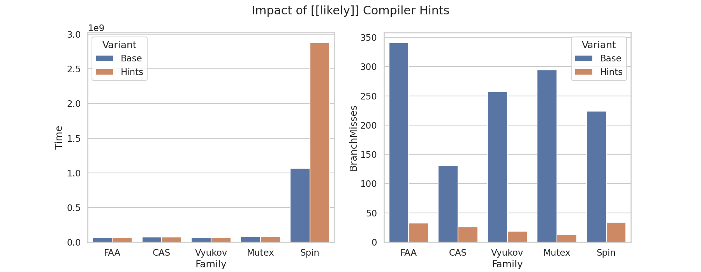
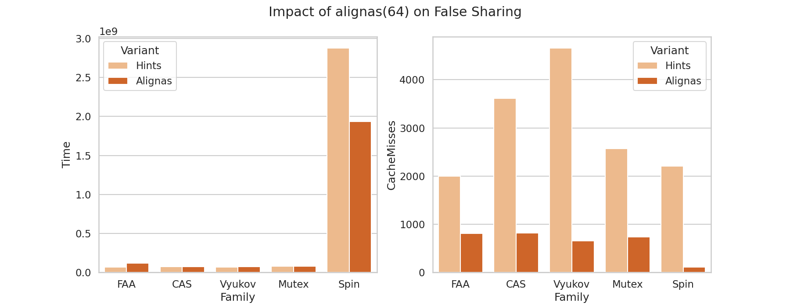
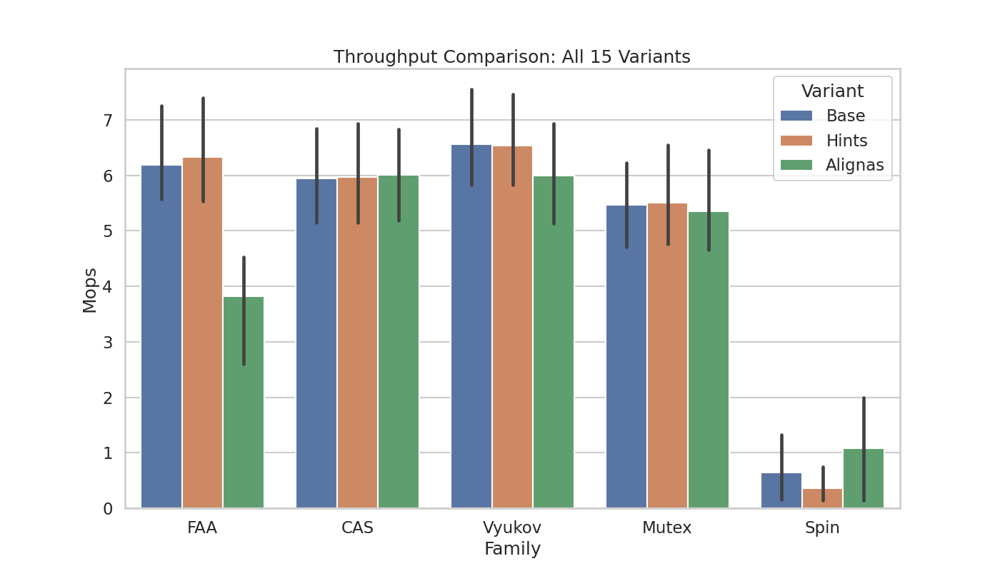
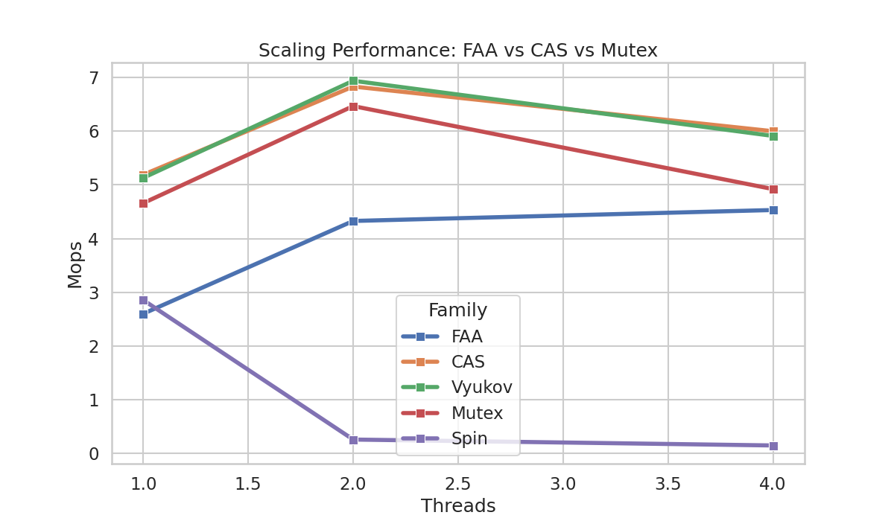
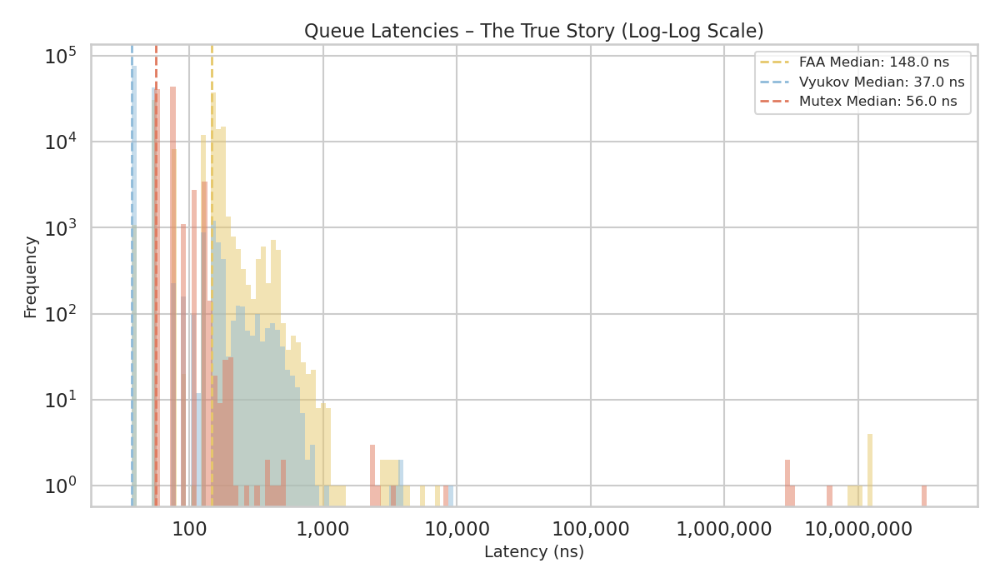
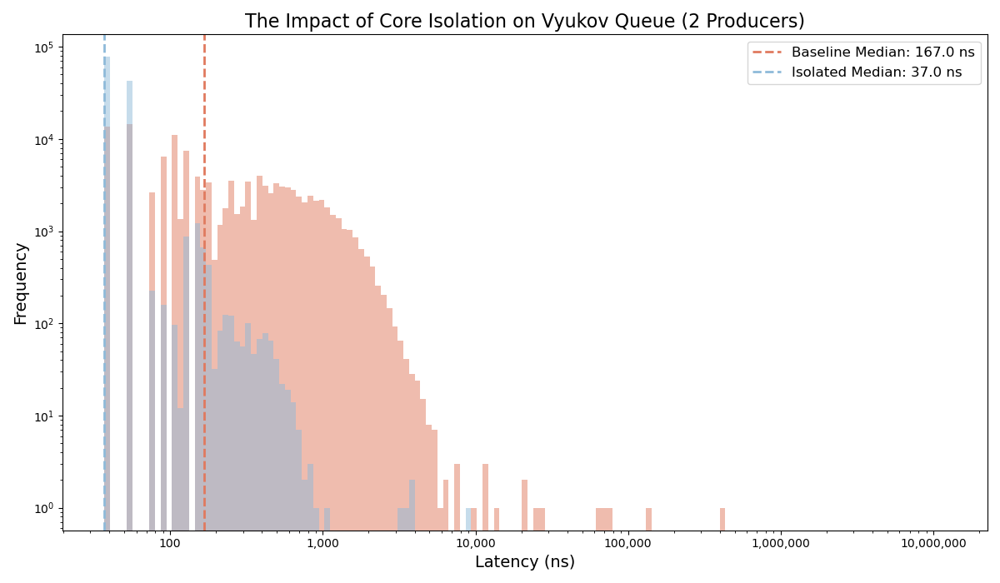
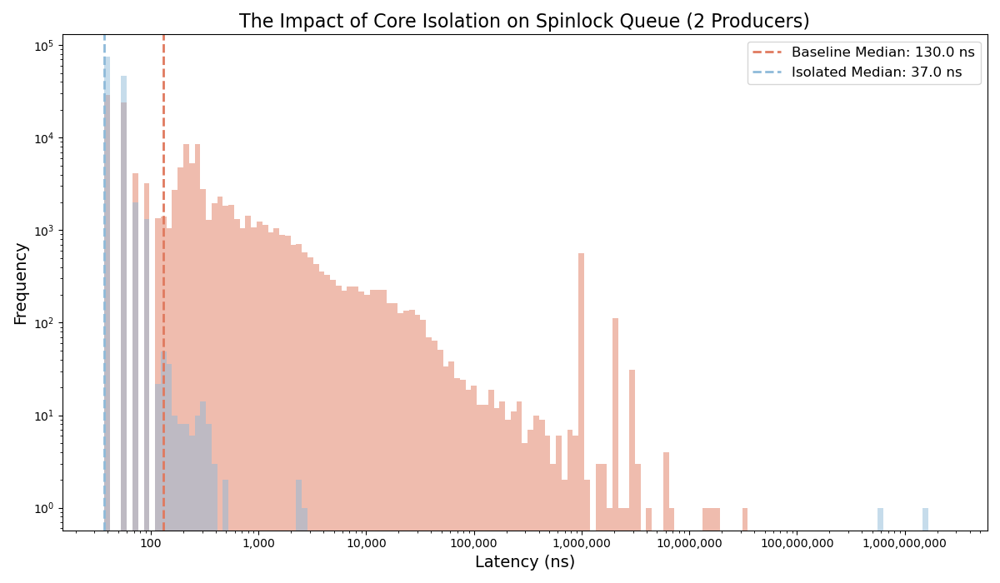
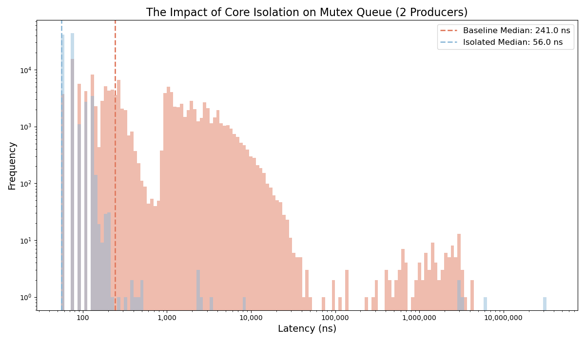
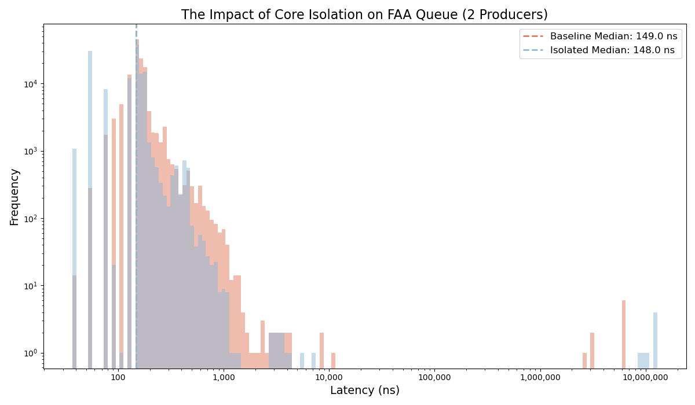

# Low-Latency MPSC Queue Evaluation: Hardware-Bound Concurrency on ARM
**A comprehensive benchmarking suite analyzing the impact of branch prediction, cache-line false sharing, thread contention, and OS jitter on lock-free data structures.**

## 📌 TL;DR
This project implements and aggressively benchmarks four Multi-Producer, Single-Consumer (MPSC) queue architectures in C++. By systematically optimizing memory layouts (`alignas(64)`) and bypassing the Linux OS scheduler (`isolcpus`), this test proves that **user-space lock-free algorithms (Vyukov) can achieve sub-40ns median latencies and >7.4 Million operations per second**, while unpinned spinlocks suffer catastrophic tail-latency degradation under thread preemption.

## 🔬 Methodology & Hardware
Benchmarking concurrent data structures on a standard OS yields noisy, inaccurate data due to kernel context switching. To capture true hardware-bound metrics, this suite was executed on a **Raspberry Pi 5 (Broadcom BCM2712, 4-core Cortex-A76 @ 2.4GHz)** with a custom bare-metal tuning approach:
1. **CPU Isolation (`isolcpus=2,3`):** Cores 2 and 3 were strictly isolated from the Linux scheduler via boot parameters (`cmdline.txt`), preventing background tasks and network interrupts from polluting the L2 cache.
2. **Governor Tuning:** All cores were locked to the `performance` governor (2.4GHz) to prevent deep-sleep wake latency.
3. **Hardware Counters:** Google Benchmark was paired with Linux `perf` to track L1/L2 cache misses and branch mispredictions.

---

## 🛠️ Phase 1: Micro-Optimizations & Architectural Anomalies
Before scaling threads or tuning the OS, the core C++ implementations were optimized for the ARM pipeline. However, the data revealed that "standard" optimizations do not always yield linear improvements.

### 1. Defeating Branch Mispredictions (`[[likely]]`)

**Expectation:** Tagging fast-paths with C++20 `[[likely]]` should reduce pipeline flushes and improve performance across all architectures.
**The Reality:** While Vyukov and FAA saw significant gains, the **Spinlock performance actually degraded**. 
* **Analysis:** In a highly contended Spinlock, the "unlikely" path (the spin loop) is actually executed thousands of times more often than the "likely" path (acquiring the lock). By forcing the compiler to optimize for the acquisition, we likely de-optimized the tight fetch-and-retry loop, causing the CPU to miss-speculate during the long wait periods.

### 2. Eliminating False Sharing (`alignas(64)`)

**Expectation:** Forcing atomic variables onto separate 64-byte cache lines should reduce "Cache-Line Bouncing" and lower total execution time.
**The Reality (The FAA Paradox):** In the FAA (Fetch-and-Add) implementation, we observed that **Total Cache Misses fell, but Execution Time rose**.
* **Analysis:** This is a classic "Spatial Locality vs. Contention" trade-off. By using `alignas(64)`, we successfully stopped the cores from fighting over the same line (reducing misses). However, the FAA algorithm is so compact that it originally fit within a single cache line. By padding it, we forced the CPU to load **multiple distinct cache lines** into the L1 cache just to perform a single logical operation. On the Pi 5's Cortex-A76, the latency of fetching two lines from L2 can sometimes outweigh the cost of minor contention on a single line.

### Global Throughput Summary (Post-Optimization)

Despite these trade-offs, the Vyukov State Machine and CAS algorithms emerged as the undisputed throughput champions once the memory layout was stabilized.

---

## 📊 Phase 2: Throughput & The Contention Wall
*How do these queues survive when multiple producers hammer a single consumer?*



**Key Takeaways:**
*   **The Contention Wall:** Moving from 2 to 4 threads resulted in a global throughput drop for the lock-free queues. This highlights the physical limits of ARM hardware: 4 threads fighting over the internal data bus creates massive cache-coherence traffic. 
*   **Vyukov Reigns Supreme:** Even under heavy contention, the node-based Vyukov queue peaked at over **7 Million ops/sec** under 2-thread contention, completely outclassing the `std::mutex`.
*   **Spinlock Collapse:** The standard Spinlock architecture collapsed immediately as thread counts increased, dropping to near-zero throughput due to continuous thread preemption on a shared core.

---

## 📉 Phase 3: Tail Latency & OS Jitter (The Bare-Metal Truth)
Average throughput hides catastrophic tail latencies. In High-Frequency Trading (HFT) and real-time systems, maximum latency matters more than average speed. 

To visualize this, latencies were plotted on a **Log-Log scale**. We mapped the baseline OS behavior (Red) against our mathematically isolated, bare-metal cores (Blue).

### 1. The Total System View

Running isolated on Cores 2 and 3, the true speed of the C++ implementations is revealed. The Vyukov queue hits an astonishingly tight 37ns median latency.

### 2. The Vyukov Queue: Lock-Free Perfection

By removing OS interrupts, Vyukov's median latency plummeted to **37ns**. More importantly, the baseline's 1-millisecond "smear" (caused by thread migration and context switching) was entirely eradicated. The hardware-isolated tail drops cleanly at 10,000ns.

### 3. The Spinlock: Death by Preemption

This graph visually proves the danger of user-space spinlocks. On a standard OS (Red), if a thread holding the lock is preempted, waiting threads spin uselessly at 100% CPU, causing a massive latency spike stretching to the millions of nanoseconds. Pinned to isolated cores (Blue), the spinlock cannot be preempted, collapsing the latency into a hyper-dense spike. **Conclusion: Never use spinlocks without strict 1:1 hardware thread pinning.**

### 4. The `std::mutex`: The Safe Baseline

While isolating the cores improved the Mutex median (241ns down to 56ns), the distribution remains inherently "fat". Because a Mutex must trap into the Linux kernel to sleep/wake threads upon contention, it cannot physically match the tight, predictable tail of a lock-free architecture. 

### 5. Fetch-And-Add (FAA): The Hardware Bottleneck

Unlike the others, isolating the cores barely changed the FAA queue's distribution. This indicates that FAA is not bottlenecked by the Linux kernel; it is bottlenecked at the silicon level by how the ARM architecture handles explicit atomic fetch-and-add instructions and cache-line bouncing. 

---

## 🚀 How to Reproduce
To run this benchmarking suite locally:

1. Build the project: 
   ```bash
   mkdir build && cd build && cmake .. && make
   ```
2. Run standard baseline:
    ```bash
    /scripts/run_benchmarks.sh
    ```
3. For bare-metal precision, isolate your CPU cores and use taskset:
    ```bash
    taskset -c 2,3 ./scripts/run_benchmarks.sh
    ```